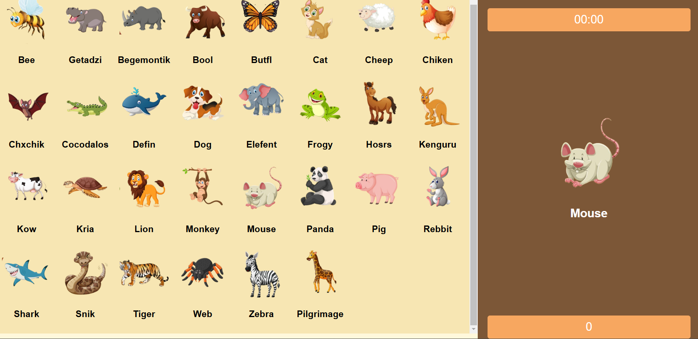

<div align="center">


<h2 align="center">Find Animals</h2>


<a href="https://astghik1100.github.io/Find-Animals/"><strong>➥ Live Demo</strong></a>

</div>

<br />

### Demo Screeshots



### Prerequisites

Before you begin, ensure you have met the following requirements:

* [Git](https://git-scm.com/downloads "Download Git") must be installed on your operating system.

### Run Locally

To run **Word Scramble** locally, run this command on your git bash:

Linux and macOS:

```bash
sudo git clone https://github.com/astghik1100/Find-Animals.git
```

Windows:

```bash
git clone https://github.com/astghik1100/Find-Animals.git
```


### License

This project is **free to use** and does not contains any license.